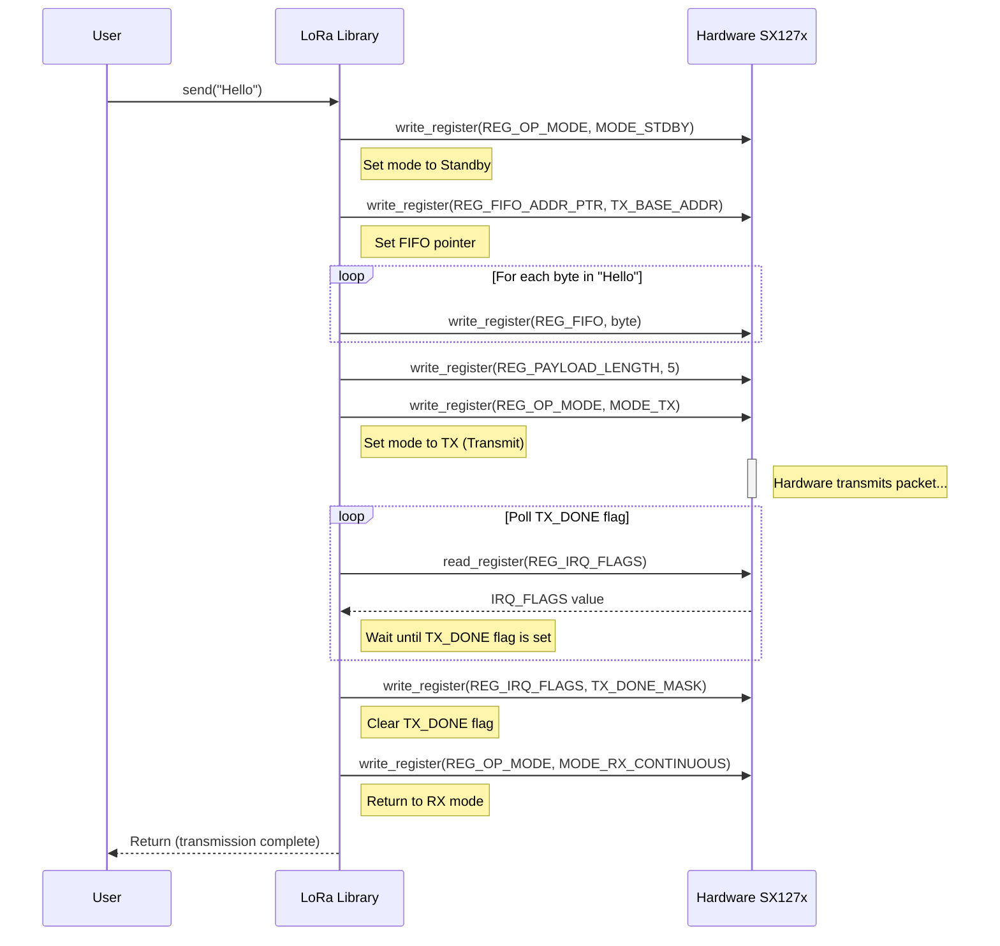
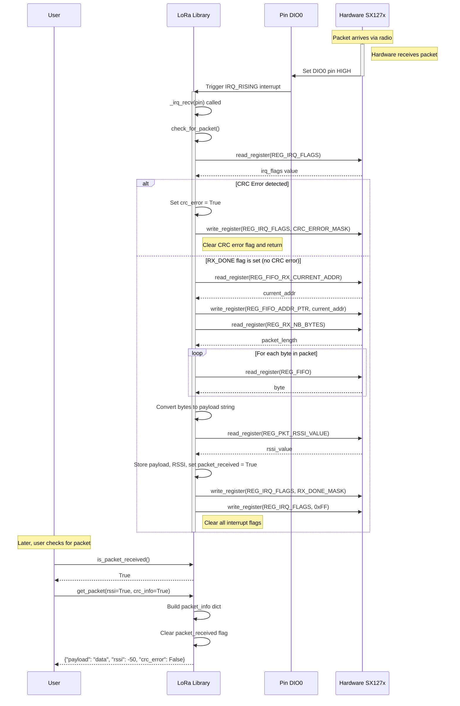

# MicroPython LoRa SX127x Library

This library provides a simple and efficient implementation to control LoRa modules based on the SX127x chip (such as SX1276/77/78/79) using MicroPython.

### Diagrama de Secuencia de Envío

### Diagrama de Secuencia de Recepción

## Hardware Connections

Connect the LoRa SX127x module to your microcontroller using SPI:

| LoRa Module | Microcontroller |
| ----------- | --------------- |
| VCC         | 3.3V            |
| GND         | GND             |
| MISO        | MISO (GPIO)     |
| MOSI        | MOSI (GPIO)     |
| SCK         | SCK (GPIO)      |
| NSS/CS      | CS (GPIO)       |
| RESET       | RESET (GPIO)    |
| DIO0        | DIO0 (GPIO)     |

## Parameter Configuration

### Frequency (`set_frequency`)

- **Value**: In Hz (example: `915E6` for 915 MHz)
- **Common**:
  - 915 MHz (Americas)
  - 868 MHz (Europe)
  - 433 MHz (Asia)

### Spreading Factor (`set_spreading_factor`)

- **Range**: 6 to 12
- **SF7**: Higher speed, shorter range
- **SF12**: Lower speed, longer range
- **Default**: 7

### Bandwidth (`set_bandwidth`)

- **Values**: 7800, 10400, 15600, 20800, 31250, 41700, 62500, 125000, 250000 Hz
- **Default**: 125000 Hz

### Coding Rate (`set_coding_rate`)

- **Range**: 5 to 8 (represents 4/5, 4/6, 4/7, 4/8)
- **Higher value**: Better error protection, lower speed
- **Default**: 5 (4/5)

### TX Power (`set_tx_power`)

- **Range**: 2 to 20 dBm (with PA_BOOST)
- **Default**: 17 dBm

## Configuration Functions

- `set_frequency(frequency)`: Set operating frequency
- `set_spreading_factor(sf)`: Set spreading factor (6-12)
- `set_bandwidth(bw)`: Set bandwidth
- `set_coding_rate(denom)`: Set coding rate (5-8)
- `set_tx_power(power, use_pa_boost)`: Set transmission power
- `enable_crc()`: Enable CRC verification
- `disable_crc()`: Disable CRC verification
- `has_crc_error()`: Check if the last packet had a CRC error
- `get_packet(rssi=False, crc_info=False)`: Get packet with CRC information
